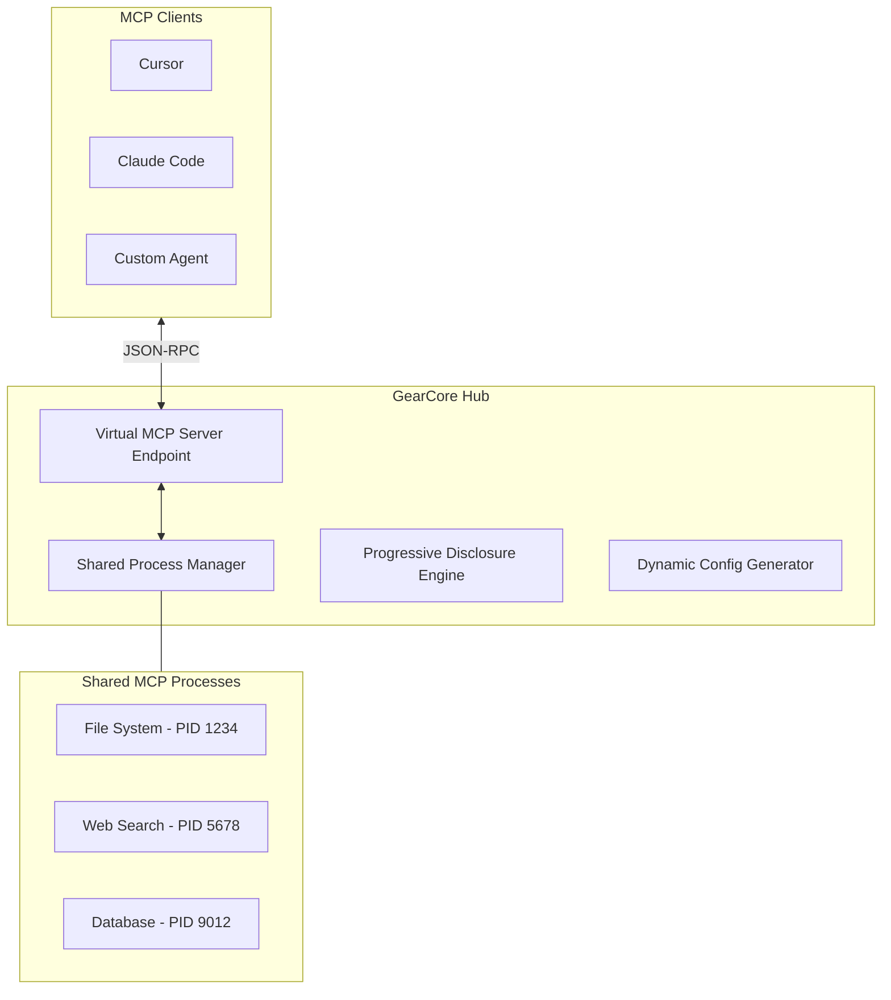

# GearCore: Shared Hub Architecture Specification

## 1. High-Level Topology: The "Shared Hub" Model

Instead of every client (Cursor, Claude Code, CLI) spinning up their own `stdio` instances of the same MCP servers, GearCore acts as a **Centralized Service Manager**. 

It runs **one universal process** for each MCP server and exposes them via a single local endpoint (SSE or WebSockets) to all consuming clients.

---

## 2. Key Architectural Shifts

### A. Resource Optimization (Single-Instance)
*   **The Problem:** Currently, if you have 3 clients open, you might have 3 instances of a "heavy" Python-based MCP server running, each consuming 200MB+ of RAM.
*   **The GearCore Solution:** GearCore launches the process **once**. It then multiplexes requests from multiple clients to that single process. This ensures state consistency (e.g., a "Search Cache" is shared across all clients) and saves significant system resources.

### B. GearCore as a "Virtual MCP Server"
To the client (Claude Code/Cursor), GearCore looks like **one single, massive MCP server**. 
*   **Clients connect to:** `http://localhost:XXXX/sse`
*   **GearCore exposes:** A "Virtual Toolset" that it dynamically constructs by aggregating (and filtering) tools from all active shared backends.

### C. Dynamic Configuration (The "Configurator" Role)
For clients that don't support dynamic tool discovery well (some require a hard `mcp.json`), GearCore acts as a **Centralized Config Manager**.
*   It can "Sync" your `mcp.json` across all your dev tools.
*   It provides a "Registry" that tells clients how to connect to the GearCore Hub.

---

## 3. The "Discovery" Flow (Refined)

The "Progressive Disclosure" now happens at the **Virtual Server** level:

1.  **Initial Handshake:** GearCore returns only a "Bootstrap" toolset to the client.
2.  **Session Context:** As the user/model works, GearCore monitors the conversation (or accepts explicit `request_skill` calls).
3.  **Live Updates:** GearCore uses the `notifications/tools/list_changed` method (part of the MCP spec) to tell the client, "Hey, I just found 10 new tools for you!" without requiring a client restart.

---

## 4. Conflict Resolution & Merging

When multiple shared backends offer the same tool (e.g., `read_file`), GearCore's **Conflict Resolver** performs:
1.  **Semantic Merging:** If the schemas are identical, it routes to the "Primary" provider.
2.  **Namespacing:** If they differ, it exposes them as `fs_read_file` and `git_read_file`.
3.  **Unified Interface:** It can expose a single `smart_read` tool that decides which backend to use based on the file path.
