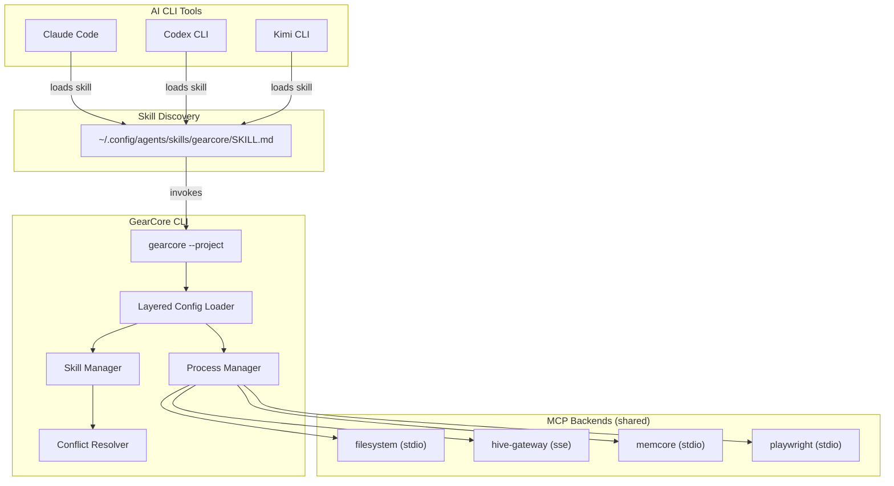

# GearCore: Architecture (v2)

## Overview

GearCore is a **CLI binary that registers itself as a skill** in AI CLI tools (Claude Code, Codex, Kimi). When invoked, it serves as an MCP hub that aggregates tools from registered backend servers and exposes them through progressive disclosure.

The key architectural shift from v1: GearCore is **not** an MCP server that clients add to their `mcpServers` config. It is a **skill** that clients discover via their native skill loading mechanism (`SKILL.md` in the skills directory).

---

## System Topology



---

## Layered Configuration

GearCore loads config in two layers. The project layer narrows scope via allowlists — it can never widen beyond what's in the global registry.

```
Built-in defaults
    ↓
~/.config/gearcore/config.yaml     (global — all MCPs, all skills)
    ↓
<project>/.gearcore/config.yaml    (project — allowlisted subset + locals)
```

**Project detection:** explicit `--project <path>` flag, or auto-detect by walking up from CWD looking for a `.gearcore/` directory.

### Effective config assembly

1. Load global config → all registered MCP servers, all skill dirs
2. If project context present → load project config
3. Filter global MCP servers through `scope.mcp_servers.include` allowlist
4. Filter global skills through `scope.skills.include` allowlist
5. Append project-local skills from `.gearcore/skills/` (always included)
6. Apply disclosure overrides from project (core_skills, threshold)

---

## Skill Visibility Model

| Skill source | No project context | In project (allowlisted) | In project (not allowlisted) |
|---|---|---|---|
| Global skill | Visible | Visible | **Hidden** |
| Project-local skill | **Never visible** | **Always visible** | N/A |

Project-local skills don't need allowlisting — their presence in `.gearcore/skills/` implies inclusion.

---

## Progressive Disclosure Flow

```
AI invokes gearcore
    ↓
list_tools → returns only: list_skills, request_skill (bootstrap)
    ↓
AI calls list_skills → sees available skills for current context
    ↓
AI calls request_skill("code-ops") → SKILL.md injected, tools unlocked
    ↓
list_tools → now includes code-ops tools (read_file, write_file, ...)
```

Tools from MCP backends are **hidden** until the skill that references them is activated. The `is_tool_active()` check gates every tool in the aggregation step.

---

## Process Manager

Manages shared MCP server processes. Each server is started once and multiplexed across all tool calls.

- **stdio transport:** spawns a subprocess with command + args + env
- **sse transport:** connects to an existing HTTP/SSE endpoint
- Async lock-protected initialization (idempotent)
- `AsyncExitStack` for guaranteed cleanup on shutdown

---

## Conflict Resolution

When multiple backends expose tools with the same name:

1. **suppress_others** — only the preferred server's tool is exposed
2. **namespace** — non-preferred tools get a prefix (e.g. `fs_read_file`)
3. **unify** — a single tool name routes to the preferred backend

Resolution rules are defined in the global config under `resolution.categories`. Tools not matching any category get default server-id-prefixed namespacing.

---

## Self-Skill & Sync

GearCore includes a self-skill bundle (`src/gearcore_hub/self_skill/`) containing `SKILL.md` and `manifest.json`. The `gearcore sync` command:

1. Copies the self-skill to `~/.config/agents/skills/gearcore/` (canonical)
2. Creates symlinks from `~/.claude/skills/gearcore/`, `~/.codex/skills/gearcore/`, `~/.kimi/skills/gearcore/`, `~/.config/opencode/skills/gearcore/`

Kimi natively scans `~/.config/agents/skills/` as its highest-priority user path. Claude and Codex discover via their respective symlinked paths. OpenCode scans `{skill,skills}/**/SKILL.md` under `~/.config/opencode/` (and would also pick up the `~/.claude/skills/` symlink via its Claude Code compatibility scan, but the dedicated symlink keeps GearCore visible even when that scan is disabled).

---

## CLI-Anything Integration

`gearcore add-cli <program>` wraps a traditional program (ffmpeg, git, etc.) into a skill:

1. Invokes CLI-Anything to generate an interface specification
2. Scaffolds a skill bundle (SKILL.md + manifest.json) from the output
3. Places the bundle in the appropriate skills directory

This enables any CLI program to become a progressive-disclosure-gated skill without writing MCP servers.

---

## Module Map

| Module | Responsibility |
|--------|---------------|
| `main.py` | CLI argument parser, subcommand dispatch, `GearCoreHub` MCP runtime |
| `config.py` | `GlobalConfig`, `ProjectConfig`, `EffectiveConfig`, layered loader, project detection |
| `skill_manager.py` | Two-phase loading (global → local), visibility gating, activation tracking |
| `process_manager.py` | `SharedMCPServer` lifecycle, `ProcessManager` registry, shutdown |
| `conflict_resolver.py` | Tool deduplication, namespacing, unification |
| `registry.py` | `add-mcp`, `add-skill`, `add-cli`, `remove` — config/skill-dir mutations |
| `sync.py` | Self-skill install, symlink management across AI CLI tools |
