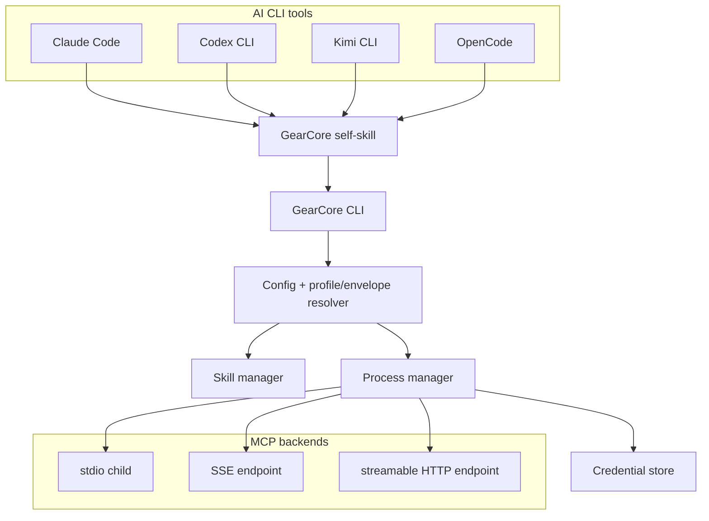

# GearCore architecture

## Overview

GearCore is a CLI binary that registers itself as a skill in Claude Code, Codex,
Kimi, and OpenCode. It aggregates registered MCP backends and skill bundles,
applies one immutable effective capability policy, and exposes tools through
progressive disclosure.

GearCore is skill-first: clients discover `SKILL.md` and invoke the CLI. `serve`
is an MCP-hub fallback for clients that need it; `call` is a stateless one-shot
backend invocation.

## System topology



## Configuration and capability resolution

The global file is `~/.config/gearcore/config.yaml`. A project is selected by an
explicit `--project PATH` or discovered by walking upward from the current
directory for the nearest `.gearcore/` directory. The directory establishes the
project root even when `config.yaml` is absent. Consumers receive only
`EffectiveConfig`; they do not re-read raw global/project data.

### Wholly version-2 behavior

Version 2 has one implicit profile named `default`:

1. Project `scope.*.include` filters global MCPs and skills.
2. Project-local skills in `.gearcore/skills/` are included in that project.
3. Project `registry.mcp_servers` definitions are included and shadow a same-ID
   global definition.
4. Project disclosure replaces global disclosure.
5. Legacy project `deny` keys are ignored.

Those are compatibility semantics, not universal v3 invariants.

### Version-3 profiles

Version 3 selects a global profile independently of cwd. The normal source is
`profiles.default` or `--profile`; a verified launch envelope is authoritative.
Each profile supplies MCP and skill `include`, `deny`, and global `protected`
sets plus disclosure/core skills.

Resolution is deterministic:

1. Start from the selected global profile.
2. Pin protected capabilities to their trusted global definitions/bundles.
3. Apply project context to non-protected IDs. A v3 same-name project profile
   entry may narrow with `include`/`deny` but cannot select a default/profile or
   declare protection.
4. Apply non-protected denies last.

Project-local IDs are not universally visible in v3. Project includes filter
them and global/profile plus project denies apply. An unconstrained profile may
admit a project-local addition unless the project overlay narrows it. A
constrained or envelope-enforced launch applies the profile include as a
capability ceiling. For an envelope-approved alternate profile, the enforced
skill-binding ceiling also prevents rebinding. A project-local collision never
replaces a protected global.

### Signed constrained envelopes

The launcher supplies `--context-envelope` and `--envelope-public-key`. GearCore
verifies an issuer-bound Ed25519 signature over canonical compact sorted JSON,
time bounds, and a configured `constrained: true` profile before starting any
backend. A requested alternate must be no broader than the signed profile.

Any missing, malformed, expired, or invalid explicit envelope fails closed. The
effective configuration becomes diagnostic-only: `call` fails, no backend
starts, and `serve` exposes only the built-in discovery/diagnostic tools.

Profiles are policy selection and defense in depth. Authenticated MCP servers
and the launcher's process/filesystem/network containment form the hostile-
process boundary.

## Skill visibility and progressive disclosure

The skill manager loads global bundles first and project-local bundles second,
then asks `EffectiveConfig` for the visible names and allowed bindings. Protected
global bundles survive same-name local collisions. Envelope binding ceilings are
checked before a bundle is exposed.

```text
AI invokes GearCore
    ↓
list_tools → list_skills and request_skill only
    ↓
list_skills → effective visible bundles
    ↓
request_skill("code-ops") → instructions plus mapped tools
    ↓
list_tools → newly activated tools
```

Names in the effective profile's `disclosure.core_skills` are level-0: they are
auto-activated in `serve`, printed inline by `list-skills`, and embedded into the
synced self-skill.

## Authenticated MCP lifecycle

`ProcessManager` builds every backend from the already-resolved
`EffectiveConfig`. `SharedMCPServer` uses an async lock for idempotent startup and
a small manual context owner that enters and exits each transport/session context
in reverse order. It intentionally does not use `AsyncExitStack`.

Supported transports are:

- `stdio`: spawn the configured child. If authenticated, resolve one
  `credential_ref` at start and inject it only into the configured private child
  environment name without mutating `os.environ` or retained configuration.
- `sse`: connect with the SSE client and an ephemeral
  `Authorization: Bearer ...` header.
- `http`: connect with the streamable HTTP client (not the SSE client) and the
  same ephemeral bearer header. Only the returned read/write streams are passed
  to `ClientSession`; the optional session-ID accessor is not a stream.

Credentials are loaded from owner-controlled, non-symlink regular files under
`~/.config/gearcore/credentials/`. Secret material exists only at transport
construction and is cleared from temporary mappings/parameters after connection
creation. Missing or unsafe credentials prevent backend startup. `call` and
`serve` share the same `ProcessManager.build_server()` path.

## Conflict resolution

When active backends expose the same tool name, global
`resolution.categories` selects `suppress_others`, `namespace`, or `unify`.
Capability/profile resolution occurs before tool conflict resolution, so a
denied backend cannot reappear through namespacing.

## Self-skill and sync

`gearcore sync` copies the rendered self-skill to
`~/.config/agents/skills/gearcore/`. It creates client-specific symlinks only
for clients selected with `--tool` or detected on `PATH`; it does not
unconditionally link all four supported clients. The
`<!-- GEARCORE:LEVEL0 -->` marker is replaced from the single effective
configuration's selected profile core skills, without reloading configuration.

## Module map

| Module | Responsibility |
|---|---|
| `main.py` | CLI parser, one-time effective-config construction, commands, hub runtime, stable status |
| `config.py` | v2/v3 models, project discovery, immutable `EffectiveConfig`, launch selection |
| `profiles.py` | Capability policy models, protected/deny resolution |
| `envelope.py` | Canonical Ed25519 launch-envelope verification and subset checks |
| `credentials.py` | Secure credential-reference validation and file loading |
| `skill_manager.py` | Bundle loading, visibility, protected/binding collision handling, activation |
| `process_manager.py` | Authenticated stdio/SSE/streamable-HTTP lifecycle and cleanup |
| `conflict_resolver.py` | Tool deduplication, namespacing, and unification |
| `registry.py` | Atomic registry mutation, including global `profile-set` |
| `sync.py` | Rendered self-skill installation and client symlinks |
| `render.py` | Shared instruction and level-0 rendering |
